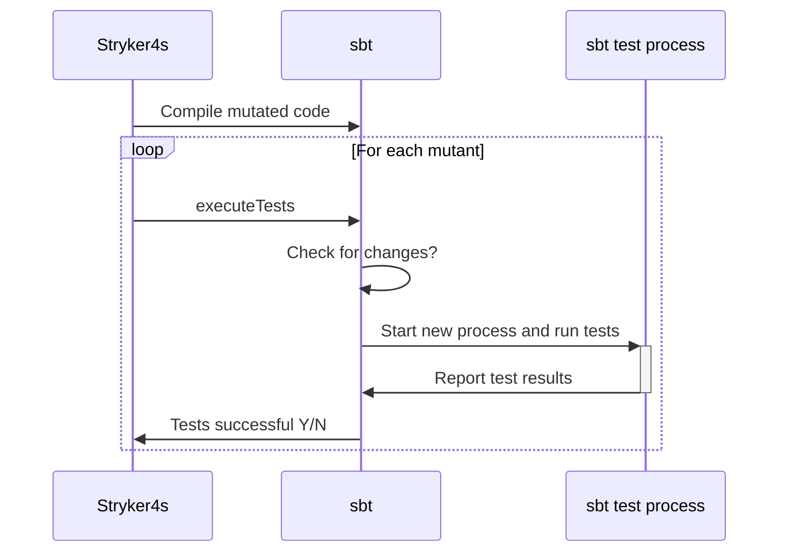
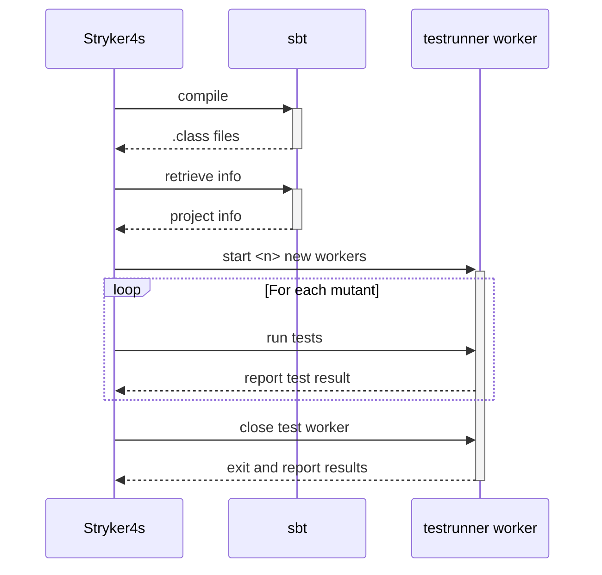

Stryker4s is your friendly mutation testing framework for Scala. Compared to earlier versions, Stryker4s `0.12` achieves a 60x speed increase in some scenarios 🤯. Are you curious to know how? Keep on reading.

<!--truncate-->

If you're new to mutation testing, it's a way to measure your tests' effectiveness. A mutation testing framework will make small changes, called _mutants_, one by one in your source code. Then it will run your tests to see if one of them fails. If so, you just "killed" that mutant; if not, it "survived". If too many mutants survive, you probably want to improve your tests. The mutation testing report will give you insides into the test cases you may have missed. If this all sounds complicated, please take a look at the recent talk ["Who is testing your tests?"](https://www.youtube.com/watch?v=Vq9eqZzblfg) from _Scala Love in the City_ or check out the rest of the [website](/).

In this blog we'll talk about the performance improvements made in the last couple Stryker4s versions and dive into how they are made possible.

## 📃 In short

Imagine you're on your way to a sunny holiday destination. You've checked in your luggage, gone through customs, and boarded the plane. Then, the plane moves forward a couple of meters, and you're thrown out and sent back to customs before going through the whole thing again. It'll take years before you get to sip on your umbrella cocktail 🍹! This is exactly how Stryker4s has been running your code… until now.

A lot has changed in recent versions of Stryker4s. Stryker4s now runs your tests in an entirely different way, bringing big performance improvements. As an example, running Stryker4s on the Stryker4s codebase used to take about 40 minutes on `0.9.1`. On`0.12.1`, this has been reduced to a fast 40 seconds. A short list of some new features:

- ✨ New testrunner boasting improved performance
- 🔀 Concurrency to improve speed by using all available cores
- 🕵️‍♀️ Coverage analysis to skip mutants without coverage
- ⏱️ Timeout detection in tests
- 👽 New mutator: regular expressions. Thanks to [Weapon regeX](https://github.com/stryker-mutator/weapon-regex/)!

In the rest of this blog post, we'll do a deep-dive into the increased performance. Let's start by taking a look at the older version of Stryker4s.

## 🐢 The old

In the older sbt plugin, there was a lot of overhead in running your tests. As a quick reminder, Stryker4s uses [mutation switching](https://stryker-mutator.io/blog/mutation-switching/), so it only has to compile your code once, instead of for each mutant. After mutating your source code, Stryker4s would essentially just call `sbt test` with the mutated code for every mutant. This means sbt would:

1. Look for code changes (which there never are).
1. Make sure all compiled code is up-to-date (which it always is).
1. Start a new Java process with your class files, dependencies, and a small sbt entry point library.
1. Run your tests and report the results back to the main sbt process.
1. Repeat for the next mutant.



Doing those checks and starting a new process makes a lot of sense for a development workflow, but not for mutation testing. This implementation of the test runner hasn't changed much in the two years that the plugin has existed. Time for some improvements!

## 🐇 The new

It's clear the process can be optimized. Once Stryker4s is set up and all mutations have been compiled, the only thing we really want to do is run some tests and get a result. Sbt doesn't give plugins full control over the entire test process, but it does have all the information about _what_ your project looks like. This is something we can work with!

### 🏗️ Meet: build info

The first thing Stryker4s needs to do is figure out what tests our project contains. One of the great things about sbt is its standardization and extensibility as a build tool. Because sbt knows exactly what your project looks like, plugins can retrieve all this information. To find out what tests you have, Stryker4s uses three pieces of information from sbt:

1. `fullClasspath` location of all dependency JARs (including test-dependencies) and `.class` files of your compiled code.
2. `loadedTestFrameworks` the configured test framework. Sbt detects a couple of frameworks by default, but if you use MUnit you might remember having to add `testFrameworks += new TestFramework("munit.Framework")` to your build.sbt before MUnit can run.
3. `testGrouping` contains every test suite sbt discovers in your project.

You can try running these yourself in a sbt console to see how Stryker4s looks at your project:

```
sbt:stryker4s-core> show fullClasspath
[info] * Attributed(~/stryker4s/core/target/jvm-2.13/classes)
[info] * Attributed(~/.cache/coursier/v1/https/repo1.maven.org/maven2/org/scala-lang/scala-
library/2.13.4/scala-library-2.13.4.jar)
[info] * Attributed(~/.cache/coursier/v1/https/repo1.maven.org/maven2/com/github/pathikrit/
better-files_2.13/3.9.1/better-files_2.13-3.9.1.jar)
...
sbt:stryker4s-core> show loadedTestFrameworks
[info] Map(TestFramework(org.scalatest.tools.Framework, org.scalatest.tools.ScalaTestFramework) -> org
.scalatest.tools.Framework@2b9d52d5)
...
sbt:stryker4s-core> show testGrouping
[info] * (<default>,Vector(Test stryker4s.config.TestFilterTest : subclass(false, org.scalatest.Suite)
, Test stryker4s.extension.FileExtensionsTest : subclass(false, org.scalatest.Suite), Test stryker4s.m
utants.MutatorTest : subclass(false, org.scalatest.Suite), Test stryker4s.mutants.AddAllMutationsTest
: subclass(false, org.scalatest.Suite), ...
```

We now know what tests are in your project. Let's have a look at running those tests:

### 🧪 Meet: test interfaces

This is something our friends in the NodeJS world are (rightfully) a little [jealous of](https://stryker-mutator.io/docs/stryker-js/plugins#test-runners) 😏. When you call `sbt test`, sbt will look for any registered test frameworks that implement the [test-interface](https://github.com/sbt/test-interface) (from `loadedTestFrameworks`). This is a small collection of interfaces that let a test framework tell sbt how to run tests in that framework. Because all test frameworks in sbt implement this interface, we have a single programmatic way to call any test framework. It doesn't matter if you're using ScalaTest, MUnit, Weaver-test or anything else. Using a bit of reflection, we can create an instance of the test framework runner and run tests:

```scala
val framework = classLoader.loadClass(testFrameworkClass).getConstructor().newInstance().asInstanceOf[Framework]
val runner = framework.runner(args, remoteArgs, classLoader)

val testTasks: Array[Task] = runner.tasks(testGrouping.taskDefs)

testTasks.foreach(testTask => {
  testTask.execute()
})
```

Stryker4s can then use this to activate a mutant and instantly run the tests without any overhead from sbt.

### 🔀 Meet: concurrency

Stryker4s activates and runs each mutant one by one in isolation. This is to make sure one mutant won't have an impact on the result of another. This is done by creating a separate process for it. However, there's no rule that says we can't start multiple Java processes at the same time and run those in parallel.

With multiple separate worker-processes, each worker has its own separate memory, threads, and active mutant. This way, if one mutant results in an `OutOfMemoryError` it won't impact the others. In long-lived processes like mutation testing, the performance increases of parallelism far outweigh the overhead of starting and managing multiple workers.

### 🧰 Putting it all together

Stryker4s can start a new process with all the information collected above. Because Stryker4s now fully controls how it runs your tests, it can eliminate any overhead of starting new processes or looking for source code changes. It looks a little something like this:

1. Start new worker processes in parallel with the full test classpath and send them all the needed test setup.
1. Create a new instance of the test framework in the created process.
1. For each mutant, programmatically run the tests on the worker process.



As you can see, there's not much overhead left in running your tests. The limiting factor is now how fast your tests are! When running Stryker4s on itself, this method improves performance 60x: from 40 minutes to 40 seconds.

## 🔮 What's next?

In this post, we've shown you how Stryker4s uses sbt's test information to reduce overhead and provide massive performance increases. We're very excited for you to try out the increased performance! If you have any feedback or questions, find us on [GitHub](https://github.com/stryker-mutator/stryker4s) or [Slack](https://join.slack.com/t/stryker-mutator/shared_invite/enQtOTUyMTYyNTg1NDQ0LTU4ODNmZDlmN2I3MmEyMTVhYjZlYmJkOThlNTY3NTM1M2QxYmM5YTM3ODQxYmJjY2YyYzllM2RkMmM1NjNjZjM).

Next, we want to also bring these performance improvements to the Maven plugin, add per-test coverage support, improve the HTML report to show your tests and perhaps even support some [new languages](https://github.com/stryker-mutator/stryker4k)?
