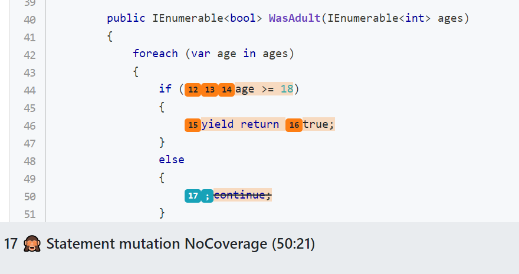

# Announcing Stryker.NET 1.0 - No more beta!

We're proud to announce the first major release of Stryker.NET: 1.0. It comes with exciting new features and an overhaul of how you interact with the Stryker CLI. With the release of Stryker 1.0 we wanted to make sure we created a cohesive and intuitive user experience.

<!--truncate-->

If you're new to mutation testing, it's a way to measure your tests' effectiveness. A mutation testing framework will make small changes, called _mutants_, one by one in your source code. Then it will run your tests to see if one of them fails. If so, you just "killed" that mutant; if not, it "survived". If too many mutants survive, you probably want to improve your tests. The mutation testing report will give you insides into the test cases you may have missed. If this all sounds complicated, please take a look at [our RoboBar 🤖🍷 example](https://stryker-mutator.io/example).

If you're new to Stryker.NET, please follow our [Getting started guide](https://stryker-mutator.io/docs/stryker-net/getting-started/). Are you already using Stryker.NET? Update to the latest version with the following command:

Global install:

```shell
dotnet tool update dotnet-stryker --global
```

Project install:

```shell
dotnet tool update dotnet-stryker --local
```

With that out of the way, let's dive into the new stuff!

## 💥 Breaking changes

### ⏭ Updated runtime

The .NET runtime for Stryker.NET has been updated from 3.1 to 5.0.

This should have some performance benefits. And helps with developing Stryker.NET in the future.

Please [download and install .NET 5.0](https://dotnet.microsoft.com/download/dotnet/5.0) or update your pipeline to support .NET 5.

_Note that you do not have to update your application to use dotnet 5. Dotnet 5 is only a runtime requirement for Stryker to be able to run on your system._

### ⏭ Options rework

Almost all options have been renamed or work different. A fundamental difference on the CLI is how multi value options are passed.

#### Multi value options

The old annotation for passing multi value options was confusing and not based on any standards. For example this is how multiple reporters were passed 👎

```shell
dotnet stryker --reporters "['html', 'progress']"
```

This now looks like 👍

```shell
dotnet stryker --reporter "html" --reporter "progress"
```

#### Options migration guide

A lot of options have been renamed. We have also decided that some options either do not belong on the commandline or don't belong in the configuration file. For example an API key should not be stored in the configuration file so that possibility has been removed.

Options migration overview:

| Old cli                       | New cli                                     | Old json                      | New json                     |
| ----------------------------- | ------------------------------------------- | ----------------------------- | ---------------------------- |
| config-file-path              | f \| config-file                            | ❌                            | ❌                           |
| max-concurrent-testrunners    | c \| concurrency                            | max-concurrent-testrunners    | concurrency                  |
| dev-mode                      | dev-mode                                    | dev-mode                      | ❌                           |
| solution-path                 | s \| solution                               | solution-path                 | solution                     |
| log-file                      | L \| log-to-file                            | log-file                      | ❌                           |
| log-level                     | V \| verbosity                              | log-level                     | verbosity                    |
| mutation-level                | l \| mutation-level                         | mutation-level                | mutation-level               |
| threshold-high                | ❌                                          | thresholds.high               | thresholds.high              |
| threshold-low                 | ❌                                          | thresholds.low                | thresholds.low               |
| threshold-break               | b \| break-at                               | thresholds.break              | thresholds.break             |
| reporters                     | r \| reporter (flag allowed multiple times) | reporters                     | reporters                    |
| project-file                  | p \| project                                | project-file                  | project                      |
| diff                          | since                                       | diff                          | since                        |
| timeout-ms                    | ❌                                          | timeout-ms                    | additional-timeout           |
| excluded-mutations            | ❌                                          | excluded-mutations            | ignore-mutations             |
| ignore-methods                | ❌                                          | ignore-methods                | ignore-methods               |
| mutate                        | m \| mutate                                 | mutate                        | mutate                       |
| language-version              | ❌                                          | language-version              | language-version             |
| coverage-analysis             | ❌                                          | coverage-analysis             | coverage-analysis            |
| abort-test-on-fail            | ❌                                          | abort-test-on-fail            | disable-bail                 |
| disable-testing-mix-mutations | ❌                                          | disable-testing-mix-mutations | disable-mix-mutants          |
| test-projects                 | ❌                                          | test-projects                 | test-projects                |
| dashboard-url                 | ❌                                          | dashboard-url                 | dashboard-url                |
| dashboard-api-key             | dashboard-api-key                           | dashboard-api-key             | ❌                           |
| project-name                  | ❌                                          | dashboard-project             | project-info.name            |
| module-name                   | ❌                                          | dashboard-module              | project-info.module          |
| project-version               | v \| version                                | dashboard-version             | project-info.version         |
| diff-ignore-files             | ❌                                          | diff-ignore-files             | since.ignore-changes-in      |
| azure-storage-url             | ❌                                          | azure-storage-url             | baseline.azure-fileshare-url |
| dashboard-fallback-version    | ❌                                          | dashboard-fallback-version    | baseline.fallback-version    |
| baseline-storage-location     | ❌                                          | baseline-storage-location     | baseline.provider            |
| dashboard-compare             | with-baseline                               | dashboard-compare             | baseline                     |
| git-diff-target               | \--since ...                                | git-diff-target               | since.target                 |
| azure-storage-sas             | azure-fileshare-sas                         | azure-storage-sas             | ❌                           |
| files-to-exclude              | ❌                                          | ❌                            | ❌                           |
| test-runner                   | ❌                                          | ❌                            | ❌                           |

❌ means the option has been removed.

## 🚀 What's new?

An exciting set of new features has been added with this release! Let's walk through them all:

### Statement removal mutator

We introduced a new mutator that removes statements that otherwise would have been untouched by other mutators.



The mutator will remove the following statements:

- `return`
- `break`
- `continue`
- `goto`
- `throw`
- `yield return`
- `yield break`
- `expression`

### Allow failing tests

It's now allowed to start a mutation test run even with failing tests. Stryker will try to make the best of the situation by marking mutants that are covered by `initially failing tests` as `survived`.

### Mutant filtering

It's now possible to filter mutants at source code level using special comments. This gives the most fine grained level of control.

The syntax for the comments is: `Stryker [disable|restore][once][all| mutator list][: reason for disabling]`

`// Stryker disable all` Disables all mutants from that line on.

`// Stryker restore all` re-enables all mutants from that line on.

`// Stryker disable once all` will only disable mutants on the next line.

`// Stryker disable once Arithmetic,Update` will only disable Arithmetic and Update mutants on the next line

Example:

```csharp
var i = 0;
var y = 10;
// Stryker disable all : for explanatory reasons
i++; // won't be mutated
y++; // won't be mutated
// Stryker restore all
i--; // will be mutated
// Stryker disable once all
y--; // won't be mutated
i++; // will be mutated
// Stryker disable once Arithmetic
y++; // will be mutated
// Stryker disable once Arithmetic,Update
i--; // won't be mutated
```

_Note that this feature is scope aware. If you disable mutators inside a method, the scope will not leak outside the method even if there is more code below._

### Ignore mutations

The ignore mutations option has been extended to offer more fine grained control. Before v1.x it was possible to ignore complete mutators. Now it's possible to ignore specific mutants inside these mutators as well.

Example:

```json
"stryker-config": {
    "ignore-mutations": [
        "linq.First",
        "linq.Sum"
    ]
}
```

> Note: this only works for Linq mutations for now but we plan to bring this functionality to all mutations.

### MsBuild path option

By default Stryker tries to autodiscover msbuild on your system. If Stryker fails to discover the correct msbuild you may supply the path to msbuild manually with this option.

Example:

```shell
--msbuild-path "c://MsBuild/MsBuild.exe"
```

### Target framework

If the project targets multiple frameworks, it is now possible to specify the particular framework to build against. If you specify a non-existent target, Stryker will build the project against a random one (or the only one if so).

Example:

```json
{
  "stryker-config": {
    "target-framework": "netcoreapp3.1"
  }
}
```

### Filter test cases

A long awaited feature has finally found its way into Stryker! It is now possible to exclude some test cases. For example if you have long running integration tests in your unit test project they can be disabled for Stryker. This will improve run time.

Example:

```json
{
  "stryker-config": {
    "test-case-filter": "(FullyQualifiedName~UnitTest1&TestCategory=CategoryA)|Priority=1"
  }
}
```

Uses `dotnet test --filter` option syntax, [detailed here](https://docs.microsoft.com/en-us/dotnet/core/testing/selective-unit-tests).

### Use Source Link for dashboard reporter

Filling all settings to use the dashboard reporter could be a bit of a hustle. Thanks to [Source Link](https://github.com/dotnet/sourcelink#readme), the repository URL and the full version (including the git SHA1) of a project can be included in the produced assembly.

Stryker now uses the information computed by SourceLink to automatically retrieve the project name (github.com/organization/project) and project version which are required for the dashboard reporter.

Enable this by adding the following to your `.csproj`:

```xml
  <ItemGroup>
    <PackageReference Include="DotNet.ReproducibleBuilds" Version="0.1.66" PrivateAssets="All"/>
  </ItemGroup>
```

For more information on SourceLink and ReproducibleBuilds see [SourceLink](https://github.com/dotnet/sourcelink) and [Dotnet.ReproducibleBuilds](https://github.com/dotnet/reproducible-builds)

## 🐛 Bug fixes

### No more mutated assembly on disk after Stryker run

While mutation testing Stryker replaces your system under test assembly on disk. Up till now the mutated assembly stayed in place after mutation testing was done. This had some unintended side effects. For example code coverage results could be incorrect until you rebuild your project and there was the risk of accidentally releasing/publishing the mutated assembly instead of the original if you did not rebuild your project after mutation testing in your pipelines. We now copy your original assembly before we modify it, and place it back after we're done. No more rebuild required!

## 👪 Team expansion

We welcome [Cyrille DUPUYDAUBY](https://github.com/dupdob) to the team! They have supported us with feedback, testing and development since 2018 and it was long past that we officially recognized their contributions to the project!

## 🎉 Thank you

Special thanks to [Cyrille DUPUYDAUBY](https://github.com/dupdob), [Peter Semkin](https://github.com/psfinaki), [Philip Rowan](https://github.com/philrowan-mtb), [Corentin Altepe](https://github.com/corentinaltepe), [Cédric Luthi](https://github.com/0xced), [Gregory Bell](https://github.com/grbell-ms), [John McGlynn](https://github.com/JohnMcGlynnMSFT), [Beatrice Forslund](https://github.com/Bforslund), [dukedagmor](https://github.com/dukedagmor) and anyone else we may have missed for their efforts to make this release happen 👏 We truly appreciate all the help and feedback we receive!
